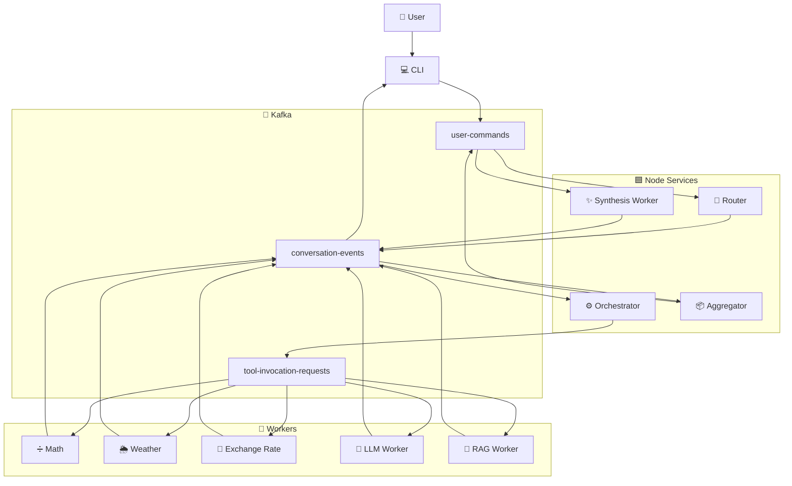

# 🤖 Kafka Event-Driven AI Agent

## 🚀 Overview

This project is a **Kafka-based, event-driven AI agent system**.

It combines:

- 🟦 **Node.js / Bun backend** under `packages/server`  
  (router, orchestrator, workers, aggregator, synthesis)

- 🐍 **Python workers** under `python-workers`  
  (RAG / product information)

- 📡 **Apache Kafka** as the event backbone and event store

- 💻 **CLI interface** that allows users to type natural-language queries and receive AI responses

The same architecture supports **product-information RAG flows**, **review analysis**, and **tool orchestration**, all connected through **Kafka topics** and **JSON-schema-validated events**.

## 🧠 Project Overview

This project implements a distributed chatbot using a **microservices architecture** in **TypeScript** (Bun runtime) with **Apache Kafka** for asynchronous communication.

✨ The system supports:

- 🧭 **Intent routing** (math / weather / exchange / general chat)
- 💾 **Persistent conversation memory**
- 🔁 **Conversation continuity across service restarts**
- 🧹 `/reset` command for clearing conversation state
- ⚡ **Asynchronous processing via Kafka topics**

---

## 🏗️ Architecture



## 🧩 Components

| Component        | Responsibility                                |
| ---------------- | --------------------------------------------- |
| CLI              | Accepts user input and displays final answer  |
| Router           | Detects intent and creates plan               |
| Orchestrator     | Executes the plan step by step                |
| Workers          | Perform weather, math, fx, LLM, and RAG tasks |
| Aggregator       | Collects intermediate results                 |
| Synthesis Worker | Produces the final response                   |

## 🧩 Main Components (Node)

### 💻 CLI

`packages/server/src/user-interface.ts`

- Bun CLI interface
- Publishes `UserQueryReceived`
- Waits for `FinalAnswerSynthesized`

---

### 🧭 Router

`packages/server/src/router.ts`

- Consumes `UserQueryReceived`
- Infers a **plan**
- Publishes `PlanGenerated`

---

### ⚙️ Orchestrator

`packages/server/src/orchestrator.ts`

Stateful plan runner that:

- 🧠 Maintains conversation state
- 📤 Dispatches `ToolInvocationRequested`
- 📥 Consumes `ToolInvocationResulted`
- ✅ Emits `PlanCompleted` or `PlanFailed`

---

### 🔧 Tool Workers

- ➗ `math-worker.ts`
- 🌦️ `weather-worker.ts`
- 💱 `exchange-rate-worker.ts`
- 🤖 `llm-inference-worker.ts`

Each worker:

1️⃣ Consumes `ToolInvocationRequested`  
2️⃣ Executes the tool  
3️⃣ Emits `ToolInvocationResulted`

---

### 📦 Aggregator

`packages/server/src/aggregator.ts`

- Collects tool results
- Emits `SynthesizeFinalAnswerRequested`

---

### ✨ Synthesis Worker

`packages/server/src/synthesis-worker.ts`

- Builds the final AI answer
- Emits `FinalAnswerSynthesized`

## ▶️ Running the System (Runbook)

### 🧰 Prerequisites

- 🐳 **Docker & Docker Compose**
- ⚡ **Bun** (optional for local development)
- 🟢 **Node.js** (optional for local development)
- 🐍 **Python 3.10+** (optional for local development)

Configure Environment variables (`packages/server/.env`):

- `OPENAI_API_KEY=...` (**required** for OpenAI; used as fallback when Ollama is unavailable)
- `KAFKA_BROKERS=localhost:9092` (optional when running **outside** Docker)
- `OLLAMA_URL=http://localhost:11434/api/chat` (optional when running **outside** Docker)
- `OLLAMA_MODEL=llama3` (optional; default `llama3` for LLM inference worker)
- `OLLAMA_ROUTER_MODEL=llama3` (optional; default `llama3` for plan generation)
- `OLLAMA_TIMEOUT_MS=30000` (optional; default **30 seconds**). Timeout for Ollama requests; after this, the app falls back to OpenAI. Increase this in `.env` or Docker if your model is slow (e.g. `60000` for 1 minute).

When running inside Docker, the stack includes an **Ollama** service. The Router and LLM Inference Worker get `OLLAMA_URL=http://ollama:11434/api/chat` automatically. Kafka is used as `kafka:29092`.

---

### 1️⃣ Start the system

Navigate to:

```bash
cd packages/server
```

Then start the entire system:

First run:
```bash
docker compose up -d --build
```
After that, usually you only need:
```bash
docker compose up -d
```

This will start:
- Zookeeper
- Kafka
- Kafka topic initialization
- **Ollama** (local LLM; used by Router and LLM Inference Worker with OpenAI fallback)
- Router
- Orchestrator
- Math Worker
- Weather Worker
- Exchange Rate Worker
- LLM Inference Worker
- Aggregator
- Synthesis Worker
- Python RAG Worker

All services run in the background.

**First-time Ollama setup:** After the stack is up, pull a model once so that Ollama can serve requests (otherwise the app falls back to OpenAI):

```bash
docker compose exec ollama ollama pull llama3
```

If Ollama is slow or does not respond in time, requests fall back to OpenAI after 30 seconds (configurable via `OLLAMA_TIMEOUT_MS`; e.g. set to `60000` in `.env` for 1 minute).

---

### 2️⃣ Check that services are running

```bash
docker compose ps
```
Example output:
```bash
NAME                     STATUS
kafka                    Up
ollama                   Up
router                   Up
orchestrator             Up
math-worker              Up
weather-worker           Up
exchange-rate-worker     Up
llm-inference-worker     Up
aggregator               Up
synthesis-worker         Up
rag-worker               Up
```
---

### 3️⃣ Viewing logs

To watch logs from all services in real time:

```docker compose logs -f```

Example output:
```bash
router-1           | Router received user query
orchestrator-1     | PlanGenerated event received
math-worker-1      | Calculating result
weather-worker-1   | Fetching weather data
rag-worker-1       | Running RAG retrieval
```
To inspect logs from a specific service, for example router:
```docker compose logs -f router```

---
### 4️⃣ Launch the CLI
Once the system is running, in another terminal, start the CLI:
```bash
cd packages/server
docker compose --profile cli run --rm user-interface
```

You should see:
```You>```

The CLI:
- Publishes ```UserQueryReceived```
- Waits for ```FinalAnswerSynthesized```
- Prints the final assistant response

## 🐳 Working with Docker

### Managing services

Restart a service **(if you modify a service)**:

```docker compose restart router```

Stop a service:

```docker compose stop router```

Start it again:

```docker compose start router```

---

### Rebuilding services (when needed)

A rebuild is **not required for every change.**

Use rebuild only if you changed:

- package.json
- bun.lock
- Dockerfile
- requirements.txt

Rebuild a specific service:
```docker compose up -d --build router```

Rebuild everything:
```docker compose up -d --build```

---

### Stop the system

To stop all services:
```docker compose down```

---

### When changing docker-compose.yml

To update changes:
```bash
docker compose down
docker compose up -d
```


## 🧪 Example queries

- **Orchestration (exchange conversion):**  
  `how much is 100 USD in ILS?`

- **Product / RAG:**  
  `Tell me about the Smart Watch S5.`

- **Weather advice:**  
  `I’m flying to London tomorrow, should I bring a coat?`

## 📜 Inspecting the execution log

High‑level execution traces are written to:

- `packages/server/execution-log.txt`

Each line looks like:

```text
2026-03-11T12:12:16.825Z | router | conv=cb3104e4-0e7a-9905-ed9899da1128 | PlanGenerated | {"steps":2,"tools":["getExchangeRate","calculateMath"],"final_answer_synthesis_required":true}
```
---

## Event Sourcing in This Project

This system applies **event sourcing** at the integration level: the behavior of the agent is driven by a stream of immutable Kafka events instead of direct RPC calls.

### Core event types

All events are JSON‑schema‑validated under `packages/server/schemas/**` and typed in `packages/server/src/types/events.ts`.

- **Commands (user‑facing, on `user-commands`):**
   - `UserQueryReceived` – emitted by `user-interface.ts` for each line the user types.
   - `SynthesizeFinalAnswerRequested` – emitted by `aggregator.ts` when a plan is completed and all tool results are collected.

- **Conversation events (on `conversation-events`):**
   - `PlanGenerated` – emitted by `router.ts` after a plan is inferred.
   - `ToolInvocationResulted` – emitted by any tool worker after handling a `ToolInvocationRequested`.
   - `PlanCompleted` – emitted by `orchestrator.ts` when all steps in the plan have succeeded.
   - `PlanFailed` – emitted by `orchestrator.ts` when a step fails or placeholder resolution fails.
   - `FinalAnswerSynthesized` – emitted by `synthesis-worker.ts` after building the final user answer.

- **Tool requests (on `tool-invocation-requests`):**
   - `ToolInvocationRequested` – emitted by `orchestrator.ts` when it wants a specific tool (e.g. `getWeather`, `calculateMath`, `getProductInformation`, `generalChat`) to run.

Any event that fails validation or that a component chooses not to process safely can be diverted to the **`dead-letter-queue`** topic.

### Example event sequence – currency conversion

For the question:

> `how much is 100 USD in ILS?`

The event flow is:

1. CLI → `UserQueryReceived` (topic: `user-commands`).
2. Router consumes `UserQueryReceived`, infers a plan:
   - Step 1: `getExchangeRate`.
   - Step 2: `calculateMath` with a placeholder into step 1’s result.
     It then emits `PlanGenerated` (topic: `conversation-events`).
3. Orchestrator consumes `PlanGenerated`, initializes plan state, and emits a `ToolInvocationRequested` for step 1 (`getExchangeRate`) onto `tool-invocation-requests`.
4. `exchange-rate-worker.ts` consumes this request, computes the rate, and emits `ToolInvocationResulted` with `{ rate: ... }` on `conversation-events`.
5. Orchestrator updates state, resolves placeholders for step 2 using `{{steps.1.result.rate}}`, and emits another `ToolInvocationRequested` for `calculateMath`.
6. `math-worker.ts` consumes, evaluates the expression, and emits `ToolInvocationResulted` with `{ expression, value }`.
7. Orchestrator now sees all steps completed and emits `PlanCompleted` with a map of results for steps `1` and `2`.
8. `aggregator.ts` consumes `PlanCompleted`, merges stored tool results, and emits `SynthesizeFinalAnswerRequested` on `user-commands`.
9. `synthesis-worker.ts` consumes the synthesis request, builds `FinalAnswerSynthesized` with `payload.finalAnswer`, and emits it on `conversation-events`.
10.   CLI consumes `FinalAnswerSynthesized` and prints the answer for the user.

Each of these transitions is an **immutable event** on a Kafka topic, and the system’s behavior can be reconstructed by replaying them.

---

## Stateful Stream Processing in This Project

While many workers are stateless, the **orchestrator** is a stateful stream processor:

- It consumes a stream of `PlanGenerated` and `ToolInvocationResulted` events from `conversation-events`.
- It produces a stream of `ToolInvocationRequested`, `PlanCompleted`, and `PlanFailed` events.
- It maintains **per‑conversation state** in memory, keyed by `conversationId`.

### Plan state

The `PlanState` type is defined in `packages/server/src/types/plan.ts` and stored via `services/state-store.service.ts`. For each `conversationId` it keeps:

- The `plan` (array of `PlanStep`).
- Current `status` (`PENDING`, `RUNNING`, `COMPLETED`, `FAILED`).
- A `results` map: `Record<string, unknown>` keyed by step number as string.
- `dispatchedSteps`: which steps have already been sent as `ToolInvocationRequested`.

This state enables the orchestrator to:

- Decide which step(s) are ready to be dispatched next.
- Avoid sending the same step multiple times.
- Know when all steps are completed and emit `PlanCompleted`.

### Placeholder resolution between steps

Many multi‑step plans pass data from one step to the next using placeholders like:

- `{{steps.1.result.rate}}`
- `{{steps.1.result.forecast}}`

The helper `packages/server/src/utils/placeholder-resolver.ts` takes:

- The raw `parameters` object from a plan step.
- The current `results` map.

It then:

- Recursively walks the parameters.
- Replaces placeholders with values from `results`.
- Returns `null` if any placeholder cannot be resolved yet.

The orchestrator uses this to:

- Fail early if the first step’s placeholders cannot be resolved.
- Wait until required prior steps have results before dispatching the next step.

### Idempotency

Tool workers use `alreadyProcessed` / `markProcessed` from `packages/server/src/utils/idempotency.ts` to ensure that **duplicate events for the same `(conversationId, step, tool)`** are ignored:

- Before processing a `ToolInvocationRequested`, each worker checks whether it has already processed that `(conversationId, step, tool)` key.
- If yes, it logs and skips.
- If no, it processes the request, emits `ToolInvocationResulted`, then marks the key as processed.

This is essential in Kafka‑based systems where retries or replays can deliver the same message more than once.

---

## Summary

This README centralizes:

- A **visual architecture** of the event‑driven AI agent.
- **Run instructions** for Kafka, Node services, Python workers, and the CLI.
- A detailed explanation of how **event sourcing** and **stateful stream processing** are applied using Kafka topics, the orchestrator, and workers.

Use it together with:

- `packages/server/README.md` – lower‑level server instructions.
- `packages/server/execution-log.txt` – concrete execution traces to demonstrate orchestration, RAG, and resilience scenarios.
